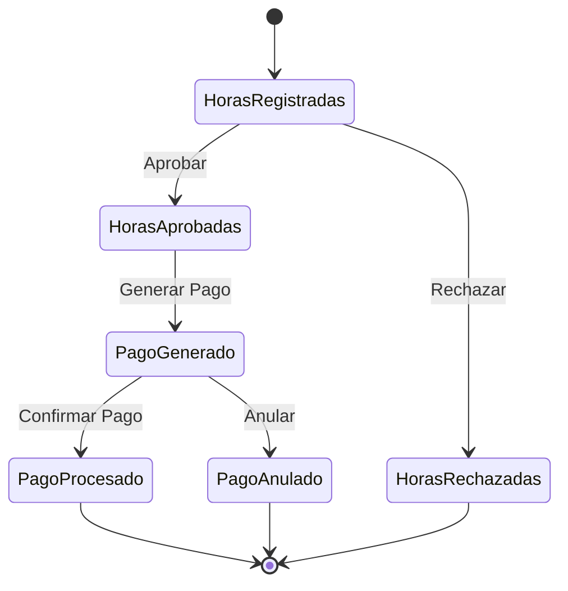

# Documento de Diseño - Gestión de Pagos de Honorarios

## Visión General

El sistema de gestión de pagos de honorarios se integrará al dashboard administrativo existente de ALI3000, aprovechando la infraestructura Laravel y las tablas de base de datos ya implementadas. El diseño se enfoca en crear un flujo eficiente desde la aprobación de horas hasta la generación y seguimiento de pagos, utilizando las funcionalidades existentes de tasa BCV automática y configuraciones de impuestos.

## Arquitectura

### Arquitectura de Capas

```
┌─────────────────────────────────────────┐
│           Capa de Presentación          │
│  (Blade Templates + Tailwind CSS)      │
├─────────────────────────────────────────┤
│           Capa de Controladores         │
│     (Laravel Controllers + Routes)      │
├─────────────────────────────────────────┤
│           Capa de Servicios             │
│  (Business Logic + Calculations)        │
├─────────────────────────────────────────┤
│           Capa de Modelos               │
│    (Eloquent Models + Relationships)    │
├─────────────────────────────────────────┤
│           Capa de Datos                 │
│      (MySQL Database + Migrations)      │
└─────────────────────────────────────────┘
```

### Integración con Sistema Existente

El módulo se integrará con:

-   **Dashboard existente**: Nuevos widgets y métricas
-   **Sidebar navigation**: Nueva sección "Gestión de Pagos"
-   **Sistema de usuarios**: Aprovecha tabla `usuarios` existente
-   **Tasa BCV**: Utiliza tabla `tasas_bcv` y comando automático
-   **Configuraciones**: Usa tabla `configuraciones` para IVA/ISLR

## Componentes e Interfaces

### 1. Controladores

#### HorasController

-   **Propósito**: Gestionar aprobación/rechazo de horas registradas
-   **Métodos principales**:
    -   `index()`: Lista horas pendientes de aprobación
    -   `aprobar(Request $request)`: Cambia estado a "aprobada"
    -   `rechazar(Request $request)`: Cambia estado a "rechazada"
    -   `filtrar(Request $request)`: Filtros por consultor, empresa, fecha

#### PagosController

-   **Propósito**: Generar y gestionar órdenes de pago
-   **Métodos principales**:
    -   `index()`: Lista pagos con filtros
    -   `generar(Request $request)`: Crea registros de pago
    -   `cambiarEstado(Request $request)`: Actualiza estado de pago
    -   `exportar(Request $request)`: Genera reportes Excel/PDF

#### ConsultoresController

-   **Propósito**: Gestionar datos laborales de consultores
-   **Métodos principales**:
    -   `index()`: Lista consultores activos
    -   `editarTarifa(Request $request)`: Actualiza tarifa_por_hora
    -   `asignarEmpresa(Request $request)`: Gestiona empresa_consultores

#### DashboardController (Extensión)

-   **Métodos nuevos**:
    -   `metricasPagos()`: Widgets de pagos para dashboard
    -   `reporteMensual()`: Datos para gráficos mensuales

### 2. Servicios de Negocio

#### CalculadoraPagosService

```php
class CalculadoraPagosService
{
    public function calcularPago($horasAprobadas, $consultor, $empresa)
    {
        // Lógica de cálculo usando configuraciones
        // Retorna array con todos los montos calculados
    }

    public function obtenerTasaBCV()
    {
        // Consulta tabla tasas_bcv para tasa más reciente
    }

    public function aplicarImpuestos($montoBase)
    {
        // Aplica IVA e ISLR desde configuraciones
    }
}
```

#### ReportesService

```php
class ReportesService
{
    public function generarReporteMensual($mes, $año)
    {
        // Consultas agregadas para métricas
    }

    public function exportarExcel($filtros)
    {
        // Genera archivo Excel con datos de pagos
    }
}
```

### 3. Modelos y Relaciones

#### Extensiones a Modelos Existentes

**Usuario Model (Extensión)**

```php
// Relaciones adicionales
public function datosLaborales()
{
    return $this->hasOne(DatosLaborales::class);
}

public function registrosHoras()
{
    return $this->hasMany(RegistroHoras::class);
}

public function pagos()
{
    return $this->hasMany(Pago::class);
}
```

**RegistroHoras Model (Extensión)**

```php
// Scopes para filtrado
public function scopePendientesAprobacion($query)
{
    return $query->where('estado', 'en_espera');
}

public function scopeAprobadas($query)
{
    return $query->where('estado', 'aprobada');
}

// Método para calcular total de horas
public function getTotalHorasAttribute()
{
    return $this->horas_normales + $this->horas_extra;
}
```

**Pago Model (Extensión)**

```php
// Scopes para reportes
public function scopePagados($query)
{
    return $query->where('estado', 'pagado');
}

public function scopePendientes($query)
{
    return $query->where('estado', 'pendiente');
}

public function scopeDelMes($query, $mes, $año)
{
    return $query->whereMonth('fecha_pago', $mes)
                 ->whereYear('fecha_pago', $año);
}
```

### 4. Vistas y Componentes UI

#### Estructura de Vistas

```
resources/views/admin/pagos/
├── index.blade.php          # Lista de pagos
├── generar.blade.php        # Formulario generación
├── detalle.blade.php        # Detalle de pago
└── reportes.blade.php       # Reportes y métricas

resources/views/admin/horas/
├── aprobar.blade.php        # Lista horas pendientes
└── detalle.blade.php        # Detalle registro horas

resources/views/admin/consultores/
├── index.blade.php          # Lista consultores
└── editar.blade.php         # Editar datos laborales
```

#### Componentes Reutilizables

**Widget de Métricas**

```blade
<div class="bg-white rounded-lg shadow p-6">
    <div class="flex items-center">
        <div class="flex-shrink-0">
            <div class="w-8 h-8 bg-blue-500 rounded-md flex items-center justify-center">
                <i class="fas fa-dollar-sign text-white"></i>
            </div>
        </div>
        <div class="ml-5 w-0 flex-1">
            <dl>
                <dt class="text-sm font-medium text-gray-500 truncate">
                    {{ $titulo }}
                </dt>
                <dd class="text-lg font-medium text-gray-900">
                    {{ $valor }}
                </dd>
            </dl>
        </div>
    </div>
</div>
```

**Tabla de Pagos**

```blade
<div class="overflow-hidden shadow ring-1 ring-black ring-opacity-5 md:rounded-lg">
    <table class="min-w-full divide-y divide-gray-300">
        <thead class="bg-gray-50">
            <tr>
                <th>Consultor</th>
                <th>Empresa</th>
                <th>Quincena</th>
                <th>Monto USD</th>
                <th>Monto Bs</th>
                <th>Estado</th>
                <th>Acciones</th>
            </tr>
        </thead>
        <tbody>
            @foreach($pagos as $pago)
                <!-- Filas de datos -->
            @endforeach
        </tbody>
    </table>
</div>
```

## Modelos de Datos

### Uso de Tablas Existentes

El diseño aprovecha completamente las tablas existentes:

**usuarios**: Consultores y administradores
**datos_laborales**: Tarifas por hora de consultores
**registros_horas**: Horas trabajadas con estados de aprobación
**pagos**: Registros completos de pagos con cálculos
**tasas_bcv**: Tasas de cambio automáticas
**configuraciones**: Porcentajes de IVA e ISLR
**empresas**: Empresas cliente
**empresa_consultores**: Asignaciones consultor-empresa

### Flujo de Estados



## Manejo de Errores

### Validaciones de Negocio

1. **Validación de Horas**:

    - No aprobar horas de fechas futuras
    - Verificar límites máximos por día (configuraciones)
    - Validar que el consultor esté asignado a la empresa

2. **Validación de Pagos**:

    - Solo generar pagos de horas aprobadas
    - Verificar disponibilidad de tasa BCV
    - Validar que no existan pagos duplicados para la misma quincena

3. **Validación de Estados**:
    - No permitir cambios de estado inválidos
    - Verificar permisos del usuario para cada acción

### Manejo de Excepciones

```php
try {
    $pago = $calculadoraService->generarPago($datos);
} catch (TasaBCVNoDisponibleException $e) {
    return back()->withErrors(['tasa' => 'No hay tasa BCV disponible']);
} catch (HorasNoAprobadasException $e) {
    return back()->withErrors(['horas' => 'Debe aprobar las horas primero']);
}
```

## Estrategia de Pruebas

### Pruebas Unitarias

1. **CalculadoraPagosService**:

    - Cálculos de IVA e ISLR
    - Conversión de divisas
    - Validaciones de datos

2. **Modelos**:
    - Relaciones entre entidades
    - Scopes y métodos personalizados
    - Validaciones de modelo

### Pruebas de Integración

1. **Flujo Completo**:

    - Aprobación de horas → Generación de pago → Cambio de estado
    - Integración con tasa BCV
    - Cálculos con configuraciones dinámicas

2. **API Endpoints**:
    - Respuestas de controladores
    - Validaciones de formularios
    - Manejo de errores

### Pruebas de Interfaz

1. **Navegación**:

    - Flujo de usuario completo
    - Filtros y búsquedas
    - Exportación de reportes

2. **Responsive Design**:
    - Funcionalidad en dispositivos móviles
    - Tablas responsivas
    - Formularios adaptativos

## Consideraciones de Rendimiento

### Optimizaciones de Base de Datos

1. **Índices Recomendados**:

    ```sql
    -- Para consultas frecuentes de pagos
    CREATE INDEX idx_pagos_estado_fecha ON pagos(estado, fecha_pago);
    CREATE INDEX idx_registros_horas_estado ON registros_horas(estado);
    CREATE INDEX idx_pagos_usuario_empresa ON pagos(usuario_id, empresa_id);
    ```

2. **Consultas Optimizadas**:
    - Usar eager loading para relaciones
    - Implementar paginación en listados
    - Cache para métricas del dashboard

### Estrategias de Cache

```php
// Cache para métricas del dashboard (5 minutos)
$metricas = Cache::remember('dashboard.metricas.pagos', 300, function () {
    return $this->calcularMetricasPagos();
});

// Cache para tasa BCV actual (1 hora)
$tasaBCV = Cache::remember('tasa.bcv.actual', 3600, function () {
    return TasaBcv::latest('fecha_registro')->first();
});
```

## Seguridad

### Control de Acceso

1. **Middleware de Autenticación**:

    - Solo usuarios autenticados pueden acceder
    - Verificación de tipo de usuario (admin)

2. **Validación de Permisos**:
    ```php
    // Solo administradores pueden aprobar horas
    if (auth()->user()->tipo_usuario !== 'admin') {
        abort(403, 'No autorizado');
    }
    ```

### Validación de Datos

1. **Sanitización de Entrada**:

    - Validación de formularios con Laravel Requests
    - Escape de datos en vistas
    - Validación de tipos de datos

2. **Protección CSRF**:
    - Tokens CSRF en todos los formularios
    - Verificación automática de Laravel

Este diseño aprovecha al máximo tu infraestructura existente mientras agrega las funcionalidades necesarias para la gestión completa de pagos de honorarios, manteniendo la consistencia con el estilo y arquitectura de tu aplicación actual.
