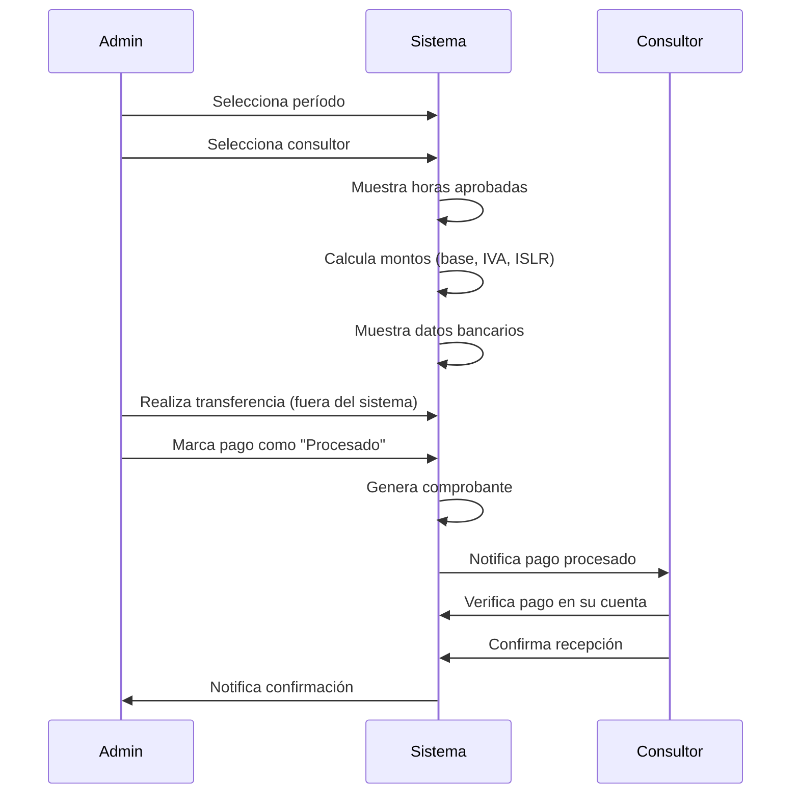
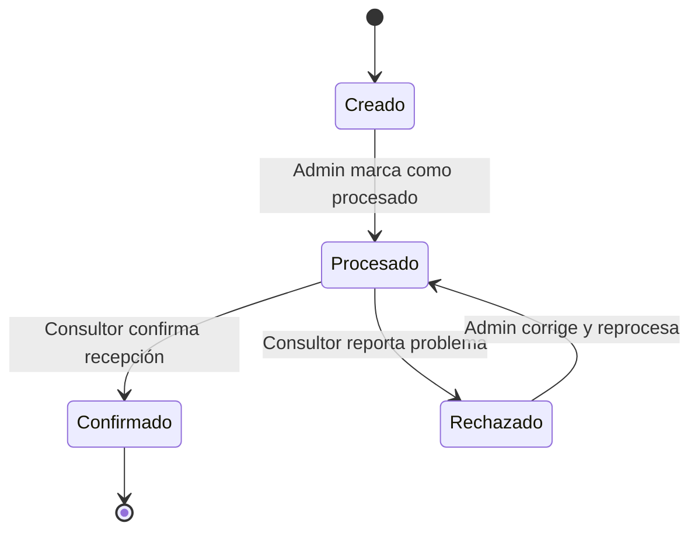

# Diseño del Módulo de Pagos Individuales

## Resumen

El módulo de Pagos Individuales permite a los administradores gestionar el proceso completo de pago a consultores de manera individual, incluyendo la selección de períodos, cálculo automático de montos con impuestos, visualización de datos bancarios, generación de comprobantes y confirmación por parte del consultor.

## Arquitectura

El módulo se integrará con el sistema existente siguiendo el patrón MVC (Modelo-Vista-Controlador) de Laravel, y utilizará servicios para la lógica de negocio compleja.

### Componentes principales:

1. **Modelos**:

    - `DatosBancario`: Nuevo modelo para almacenar información bancaria de los consultores
    - `Pago`: Modelo existente que será extendido con nuevos campos para el proceso de confirmación
    - `Usuario`: Modelo existente que se relacionará con los datos bancarios

2. **Servicios**:

    - `PagoService`: Servicio para manejar la lógica de cálculo de pagos, generación de comprobantes y notificaciones

3. **Controladores**:

    - `Admin\PagosController`: Para gestionar las operaciones de pago desde el panel de administración
    - `Consultor\PagosController`: Para gestionar la confirmación de pagos desde el panel del consultor

4. **Vistas**:
    - Formularios para la generación de pagos individuales
    - Vistas para la visualización de comprobantes
    - Interfaces para la confirmación de pagos por parte del consultor

## Componentes y Interfaces

### 1. Gestión de Datos Bancarios

#### Modelo DatosBancario

```php
class DatosBancario extends Model
{
    protected $fillable = [
        'usuario_id',
        'banco',
        'tipo_cuenta',
        'numero_cuenta',
        'cedula_rif',
        'titular',
        'es_principal'
    ];

    public function usuario()
    {
        return $this->belongsTo(Usuario::class);
    }
}
```

#### Relación en el modelo Usuario

```php
public function datosBancarios()
{
    return $this->hasMany(DatosBancario::class);
}

public function datosBancarioPrincipal()
{
    return $this->hasOne(DatosBancario::class)->where('es_principal', true);
}
```

### 2. Extensión del Modelo Pago

```php
class Pago extends Model
{
    // Campos existentes...

    // Nuevos campos
    protected $fillable = [
        // Campos existentes...
        'fecha_procesado',
        'procesado_por',
        'fecha_confirmacion',
        'comentario_confirmacion',
        'comprobante_pago'
    ];

    protected $dates = [
        'fecha_procesado',
        'fecha_confirmacion'
    ];

    public function procesadoPor()
    {
        return $this->belongsTo(Usuario::class, 'procesado_por');
    }

    // Relaciones existentes...
}
```

### 3. Servicio de Pagos

```php
class PagoService
{
    public function calcularPagoIndividual($consultor, $periodo, $horas)
    {
        // Lógica para calcular el pago basado en horas, tarifas e impuestos
    }

    public function generarComprobante($pago)
    {
        // Lógica para generar un comprobante en PDF
    }

    public function notificarConsultor($pago)
    {
        // Lógica para enviar notificación al consultor
    }
}
```

### 4. Controladores

#### Admin\PagosController

```php
class PagosController extends Controller
{
    protected $pagoService;

    public function __construct(PagoService $pagoService)
    {
        $this->pagoService = $pagoService;
    }

    public function index()
    {
        // Listar pagos
    }

    public function generarIndividual()
    {
        // Mostrar formulario para generar pago individual
    }

    public function calcular(Request $request)
    {
        // Calcular pago basado en consultor y período
    }

    public function procesar(Request $request, $id)
    {
        // Marcar pago como procesado
    }

    public function verComprobante($id)
    {
        // Ver/descargar comprobante
    }
}
```

#### Consultor\PagosController

```php
class PagosController extends Controller
{
    public function index()
    {
        // Listar pagos pendientes de confirmación
    }

    public function confirmar(Request $request, $id)
    {
        // Confirmar recepción de pago
    }

    public function historial()
    {
        // Ver historial de pagos
    }
}
```

## Modelos de Datos

### 1. Tabla datos_bancarios

```php
Schema::create('datos_bancarios', function (Blueprint $table) {
    $table->id();
    $table->unsignedBigInteger('usuario_id');
    $table->string('banco', 100);
    $table->enum('tipo_cuenta', ['ahorro', 'corriente']);
    $table->string('numero_cuenta', 30);
    $table->string('cedula_rif', 20);
    $table->string('titular', 100);
    $table->boolean('es_principal')->default(true);
    $table->timestamps();
    $table->foreign('usuario_id')->references('id')->on('usuarios')->onDelete('cascade');
});
```

### 2. Actualización de la tabla pagos

```php
Schema::table('pagos', function (Blueprint $table) {
    $table->timestamp('fecha_procesado')->nullable();
    $table->unsignedBigInteger('procesado_por')->nullable();
    $table->timestamp('fecha_confirmacion')->nullable();
    $table->text('comentario_confirmacion')->nullable();
    $table->string('comprobante_pago')->nullable();

    $table->foreign('procesado_por')->references('id')->on('usuarios');
});
```

## Manejo de Errores

1. **Validación de datos bancarios**:

    - Validar el formato del número de cuenta según el banco seleccionado
    - Mostrar mensajes de error específicos para cada campo

2. **Validación de pagos**:

    - Verificar que existan horas aprobadas para el período seleccionado
    - Validar que el consultor tenga datos bancarios registrados

3. **Manejo de excepciones**:
    - Capturar y registrar errores durante el cálculo de pagos
    - Manejar errores en la generación de comprobantes
    - Gestionar fallos en el envío de notificaciones

## Estrategia de Pruebas

1. **Pruebas unitarias**:

    - Probar el cálculo de pagos con diferentes escenarios (con/sin IVA, diferentes tasas de ISLR)
    - Verificar la validación de datos bancarios

2. **Pruebas de integración**:

    - Probar el flujo completo desde la generación del pago hasta la confirmación
    - Verificar la correcta actualización de estados

3. **Pruebas de interfaz**:
    - Comprobar la correcta visualización de datos bancarios
    - Verificar la generación y descarga de comprobantes

## Flujo de Trabajo

### 1. Flujo de Pago Individual



### 2. Estados del Pago



## Interfaces de Usuario

### 1. Generación de Pago Individual

-   Formulario con selección de período (quincenal o personalizado)
-   Selector de consultor con búsqueda
-   Vista previa de horas aprobadas
-   Cálculos detallados con desglose de impuestos
-   Visualización de datos bancarios del consultor

### 2. Comprobante de Pago

-   Diseño corporativo con logos y colores de la empresa
-   Información completa: datos del consultor, empresa, período, desglose de montos
-   Opción para descargar en PDF
-   Opción para enviar por correo

### 3. Panel del Consultor

-   Lista de pagos pendientes de confirmación
-   Opción para confirmar recepción con campo para comentarios
-   Historial de pagos recibidos con filtros por fecha
